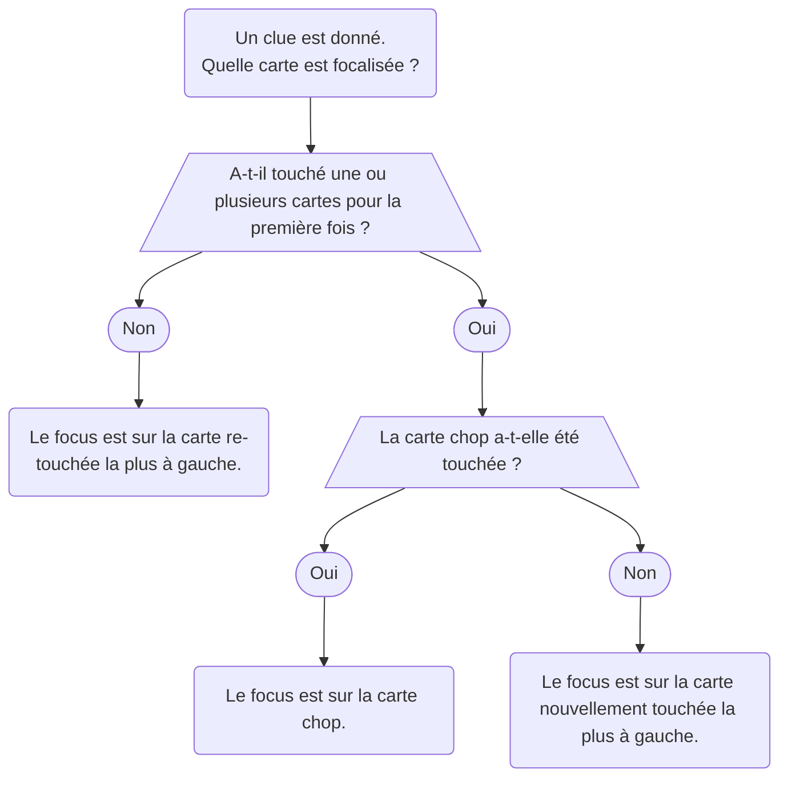

- Les stratégies du Level 1 peuvent être apprises sans avoir joué une seule partie d'Hanabi. Vous pouvez les apprendre avant votre première partie ou après quelques parties pour assimiler les mécaniques de base.
- Ce contenu est en grande partie une répétition du [guide du débutant](beginner.mdx), mais nous entrons un peu plus dans les détails ici.
- Si vous n'avez pas encore lu le guide du débutant, **ARRÊTEZ-VOUS IMMÉDIATEMENT** et lisez-le à la place. Ne revenez ici qu'après avoir joué 5 à 10 parties. (Cette page est uniquement destinée à servir de référence pour les joueurs ayant déjà lu le guide du débutant.)

## Conventions

### Le Chop

- Quand les joueurs doivent défausser, ils défaussent généralement leur carte non-cluée la plus à droite.
- Le _[chop](beginner/chop.mdx)_ d'un joueur est formellement défini comme **la prochaine carte non-cluée qu'il défausserait s'il n'avait rien d'autre à faire**.
- Si un joueur a une carte cluée connue comme étant inutile, alors il **défaussera typiquement la carte inutile en premier**, avant de défausser son chop. (Mais la carte inutile ne compte **pas** comme le chop – son chop reste la carte non-cluée la plus à droite.)

### La Définition de Playable

- _Playable_ est une propriété d'une carte. Pour commencer, voyez la section sur les _[Delayed Play Clues](beginner/delayed-play-clues.mdx)_ du guide du débutant.
- Quand nous disons qu'une carte non-cluée est actuellement _playable_, nous ne voulons **pas** dire que la carte pourrait être jouée sur les stacks immédiatement. Si une carte non-cluée est _playable_, ce que nous voulons vraiment dire est qu'il serait légal pour quelqu'un de donner soit un _[Play Clue](beginner/play-clues.mdx)_ **soit** un _Delayed Play Clue_ à la carte.
- En d'autres termes, si une carte non-cluée _playable_ recevait un _Delayed Play Clue_, cette carte finirait par jouer sur le stack sans qu'aucun clue supplémentaire n'ait besoin d'être donné par qui que ce soit – toutes les cartes intermédiaires, le cas échéant, seraient présentes et prises en compte au moment où le _Play Clue_ a été donné.

### La Définition de Trash

- _Trash_ est une propriété d'une carte. Une carte est considérée comme trash si elle ne peut jamais jouer sur les stacks ou si deux copies ou plus de la carte sont actuellement _Clued_.
- Puisque nous jouons avec le _[Good Touch Principle](beginner/good-touch-principle.mdx)_, nous évitons intentionnellement de toucher les cartes trash. Cependant, à des niveaux plus avancés, il peut parfois être avantageux de toucher des cartes trash dans certaines situations spécifiques.
- Dans de rares cas, il est possible qu'une carte soit à la fois _playable_ et trash en même temps.

### Save Clues

- Vous êtes **uniquement** autorisé à donner un _[Save Clue](beginner/save-clues.mdx)_ à une carte qui est sur le chop.
  - Cela signifie que si un clue focalise une carte non-chop, alors ce doit être un _Play Clue_ !
- Vous **n'êtes pas** autorisé à donner un _Save Clue_ à n'importe quelle carte que vous voulez. Vous êtes **uniquement** autorisé à donner un _Save Clue_ sur ces cartes spécifiques :
  1. Les 5 (avec un clue de nombre 5, comme un _[5 Save](beginner/5-save.mdx)_)
  1. Les 2 (avec un clue de nombre 2, comme un _[2 Save](beginner/2-save.mdx)_)
  1. Les cartes critiques (avec soit la couleur, soit le nombre)
- De plus, tout le monde dans le groupe accepte également de ne jamais laisser quelqu'un défausser une carte (unique) playable. Cependant, un clue à une carte unique playable est défini comme un _Play Clue_, pas un _Save Clue_.

### Clue Focus

Il y a un processus en 4 étapes pour déterminer le focus d'un clue :

1. Si aucune carte n'est nouvelle, alors **le focus est sur la carte re-touchée la plus à gauche**.
1. Si une seule carte est nouvelle, alors **le focus est sur la carte nouvelle**.
1. Si deux cartes ou plus sont nouvelles, et que l'une d'elles était sur le chop, alors **le focus est sur le chop**.
1. Si deux cartes ou plus sont nouvelles, et qu'aucune n'était sur le chop, alors **le focus est sur la carte nouvelle la plus à gauche**.

Ce processus est représenté dans l'organigramme suivant :

### Good Touch Principle

- Voyez la section sur le _[Good Touch Principle](beginner/good-touch-principle.mdx)_ du guide du débutant.

### Save Principle

- Voyez la section sur le _[Save Principle](beginner/save-principle.mdx)_ du guide du débutant.

### Minimum Clue Value Principle

- Voyez la section sur le _[Minimum Clue Value Principle](beginner/minimum-clue-value-principle.mdx)_ du guide du débutant.

### L'Early Game

- L'_[Early Game](beginner/early-game.mdx)_ est la période de temps avant qu'un joueur ait défaussé sa carte chop.
- Les joueurs **doivent** « épuiser » tous les _Play Clues_ et _Save Clues_ disponibles sur le plateau avant de terminer l'_Early Game_.
  - Comme indiqué dans le [guide du débutant](beginner/minimum-clue-value-principle.mdx), « épuiser » tous les _Play Clues_ n'inclut **pas** donner des _Tempo Clues_. Les _Tempo Clues_ ne respectent pas le _Minimum Clue Value Principle_, donc en général, ils ne devraient pas être donnés.
- Pour les joueurs de level 9, il y a [quelques règles supplémentaires](level-9.mdx#the-early-game-severity-1-stalling) sur l'_Early Game_. (Ne vous en souciez pas pour l'instant si vous n'êtes que level 1.)

## Mouvements Spéciaux

### Le 5 Save

- Un _5 Save_ est lorsque quelqu'un utilise un clue de nombre 5 pour toucher un 5 précédemment non-clué sur le chop de quelqu'un. (Tout le monde s'accorde à dire qu'il s'agit simplement d'un _Save Clue_ et non d'un _Play Clue_.)
- Par définition, vous ne pouvez effectuer un _5 Save_ qu'avec un clue de nombre. (Si un clue de couleur était utilisé pour toucher un 5 non-clué, alors ce serait un _Play Clue_ à la place.)

### Le 2 Save

- Un _2 Save_ est lorsque quelqu'un utilise un clue de nombre 2 pour toucher un 2 précédemment non-clué sur le chop de quelqu'un. (Tout le monde s'accorde à dire qu'il s'agit simplement d'un _Save Clue_ et non d'un _Play Clue_.)
- Par définition, vous ne pouvez effectuer un _2 Save_ qu'avec un clue de nombre. (Si un clue de couleur était utilisé pour toucher un 2 non-clué, alors ce serait un _Play Clue_ à la place.)
  - L'exception est si l'autre copie du 2 est dans la pile de défausse. Alors, toucher la carte avec un clue de couleur serait un _[Critical Save](beginner/critical-save.mdx)_. Mais cela ne serait pas classifié comme un _2 Save_.

#### La Visible Rule

- Les joueurs **ne sont pas autorisés** à effectuer un _2 Save_ sur un 2 si l'autre copie du 2 est visible dans la main de quelqu'un d'autre.

#### Double Chop 2's

- L'exception à la _Visible Rule_ est lorsque le même 2 est sur les chops de deux joueurs en même temps. Dans cette situation, les joueurs sont autorisés à _2 Save_ l'un ou l'autre. Et si c'est l'_Early Game_, alors les joueurs **doivent** sauvegarder l'un d'eux avant de donner un _5 Stall_ ou de défausser pour initier le _Mid-Game_.

### Le Prompt

- Un _[Prompt](beginner/prompt.mdx)_ est lorsque vous faites jouer à un joueur une carte cluée qui était précédemment inconnue.
- Si le joueur **allait déjà jouer** la carte, alors **ce n'est pas un _Prompt_**. Les _Prompts_ ne peuvent porter que sur des cartes qui n'allaient pas jouer autrement.
- Si un joueur est _Prompted_ et qu'il y a plusieurs cartes dans sa main auxquelles le _Prompt_ pourrait s'appliquer, il devrait jouer la **plus à gauche**.
- Un exemple de _Prompt_ peut être trouvé dans le [guide du débutant](beginner/prompt.mdx).
- Pour les joueurs de level 5, voyez la section _[Prompts in Multi-Color Variants](level-5.mdx#prompts-in-multi-color-variants)_.

### Le Finesse

- Un _[Finesse](beginner/finesse.mdx)_ est lorsque vous faites jouer à un joueur une carte en blind-play pour tenir une promesse qu'une certaine carte est playable immédiatement.
- Les _Finesses_ sont couverts en détail dans le [guide du débutant](beginner/finesse.mdx).
- Les _Finesses_ doivent porter sur des cartes « connectantes ». (Par exemple, le red 1 mène directement au red 2, donc ils sont considérés comme une paire de cartes « connectantes ».)
- Quand un joueur est _Finessed_, il devrait blind-play sa carte immédiatement afin de le démontrer !

### Finesse Position

- La _Finesse Position_ d'un joueur fait référence au slot de sa **carte non-cluée la plus à gauche**.
- Pour les joueurs de level 5, voyez la section _[Queued Finesse](level-5.mdx#the-queued-finesse)_.
  - Jouer avec le _Queued Finesse_ rend le concept de _Finesse Position_ plus compliqué, car cela signifie que dans certaines situations, des cartes non-cluées comptent comme étant cluées.

### Finessed Cards

- Bien que les cartes _Finessed_ soient non-cluées, vous pouvez les considérer comme ayant un clue invisible dessus. (Parce qu'elles sont déjà « obtenues ».)
- Ainsi, si un clue touche une carte _Finessed_ et une autre carte qui n'avait pas de clue dessus, alors le focus du clue serait sur l'autre carte (parce que le focus d'un clue est toujours sur la « nouvelle » carte introduite).

### Prompts > Finesses

- **Les _Prompts_ ont toujours la précédence sur les _Finesses_**.
- Cela signifie que si Alice doit décider entre :
  1. jouer une carte dans sa main avec un clue rouge dessus, et
  1. blind-play une carte rouge potentielle de sa _Finesse Position_
- Alors Alice doit toujours jouer la carte cluée.

## Fonctionnalités du Site

- Si vous avez joué quelques parties sur [Hanab Live](https://hanab.live), alors vous avez peut-être remarqué que le site possède plusieurs fonctionnalités.
- Le site dispose d'une [documentation extensive](https://github.com/Hanabi-Live/hanabi-live/blob/master/docs/features.md#notes). (Vous pouvez également accéder à cette page en appuyant sur l'icône « Help » en haut à droite du lobby du site.)
- Voici quelques-unes des fonctionnalités les plus importantes qu'un débutant devrait connaître.

### Card Notes

- Vous devriez [écrire des card notes](beginner/card-notes.mdx) à chaque partie. (Cela ne devrait pas être vu comme un handicap. Les meilleurs joueurs au monde écrivent constamment des notes.)
- Certaines notes spéciales [changent l'apparence de la carte pour vous](https://github.com/Hanabi-Live/hanabi-live/blob/master/docs/features.md#notes).
  - Si vous écrivez le nom d'une carte comme « red 2 » ou « r2 », l'image de la carte s'alignera sur la carte écrite.
  - Une note « f » est utilisée pour indiquer qu'une carte est _Finessed_ (signifiant qu'elle sera blind-play dans le futur). Le site dessine une bordure spéciale autour des cartes _Finessed_.
    - Vous pouvez utiliser `shift + clic-droit` comme raccourci pour ajouter cette note.
  - Une note « cm » est utilisée pour indiquer qu'une carte est _Chop Moved_. Le site dessine une bordure spéciale autour des cartes _Chop Moved_. (Les _Chop Moves_ sont une convention spéciale introduite au level 4. Si vous êtes un joueur de level 1, ne vous en souciez pas pour l'instant.)
    - Vous pouvez utiliser `alt + clic-droit` comme raccourci pour ajouter cette note.
  - Vous pouvez aussi utiliser des crochets pour empiler plusieurs notes. Par exemple, « [f] [red 2] ».

### Rewind

- Pendant une partie, cliquer sur le bouton flèche dans le coin inférieur gauche ouvre la [fonctionnalité de replay en jeu](https://github.com/Hanabi-Live/hanabi-live/blob/master/docs/features.md#in-game-replay).
  - Vous pouvez également utiliser les touches fléchées comme raccourci pour vous déplacer en arrière et en avant dans le temps.
- C'est utile si vous avez besoin de vous rappeler ce qui s'est passé il y a plusieurs tours.

### Empathy

- Si vous appuyez sur la barre d'espace ou que vous faites un clic-gauche sur la main de quelqu'un d'autre, vous pouvez voir comment les cartes lui apparaissent.
- C'est l'équivalent de demander « que sais-tu de tes cartes ? » dans la vraie vie.
- Cette fonctionnalité est appelée « empathy ».

## Questions de Défi

Les questions de défi pour le level 1 sont listées dans le [guide du débutant](beginner.mdx).
