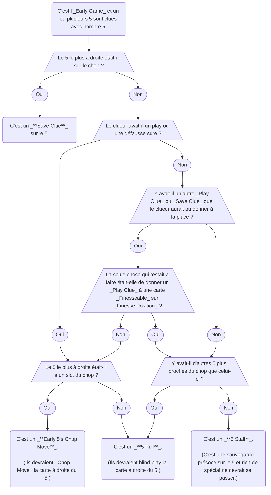

import TheFivePull from "../docs/level-19/the-five-pull.yml";
import TheFivePullPrompt from "../docs/level-19/the-five-pull-prompt.yml";
import TheFivePullDoubleFinesse from "../docs/level-19/the-five-pull-double-finesse.yml";
import TheFivePullClandestineFinesse from "../docs/level-19/the-five-pull-clandestine-finesse.yml";
import TheFivePullPromise from "../docs/level-19/the-five-pull-promise.yml";
import TheFiveNumberEjection from "../docs/level-19/the-five-number-ejection.yml";
import TheFiveNumberDischarge from "../docs/level-19/the-five-number-discharge.yml";
import InteractionsBetween2SavesAnd5Stalls from "../docs/level-19/interaction-between-2-saves-and-5-stalls.yml";

## Conventions

### La Low Score Phase et la Normal Score Phase

- À ce stade, vous devriez déjà savoir que nous divisons la partie d'Hanabi en _Early Game_ et _Mid-Game_ (basé sur quand quelqu'un défausse).
- D'une manière similaire, nous divisons aussi la partie d'Hanabi en _Low Score Phase_ et _Normal Score Phase_ :
  - La _Low Score Phase_ est définie comme quand le score est en dessous de `2 x nombre de suites`. (e.g. 10 points dans une partie sans variante, 6 points dans une partie 3-suites, etc.)
  - La _Normal Score Phase_ est définie comme quand le score est égal ou au-delà de ce seuil.
- Certains mouvements spéciaux utilisant un clue de nombre 5 ne peuvent être effectués que dans la _Low Score Phase_ de la partie.
- Sur Hanab Live, le score sera coloré en cyan quand la _Low Score Phase_ est active.

### Pas de Play Clues avec un Clue de Nombre 5 dans la Low Score Phase

- Normalement, si un joueur utilise un clue de nombre 5 pour cluer un 5 qui est à deux-ou-plus-slots-du-chop, et que ce joueur n'est pas dans une situation stalling, alors ce serait un _[Play Clue](beginner/play-clues.mdx)_ sur le 5.
- Cependant, tous les clues de nombre 5 dans la _Low Score Phase_ ne doivent **jamais** être interprétés comme un _Play Clue_ direct.
- Ils sont à la place interprétés comme un mouvement plus avancé. (Voyez la section _[5 Pull](#le-5-pull)_ ci-dessous.)
- Cela signifie que si les joueurs doivent donner un _Play Clue_ à un 5 playable, et que le score est inférieur à 2 points par stack, alors ils **doivent** utiliser un clue de couleur, ou attendre plus tard.

## Mouvements Spéciaux

### Le Early 5's Chop Move

- D'abord, voyez la section sur le _[5 Stall](level-9.mdx#le-5-stall-section-intermédiaire)_.
- Dans l'_Early Game_, les joueurs ne sont autorisés à effectuer un _5 Stall_ que s'il n'y a rien à faire. (Ou, comme exception spéciale, s'il n'y a qu'un _Play Clue_ à donner et que cette carte est sur _Finesse Position_.)
- Ainsi, si quelqu'un clue un 5 et qu'il y **a** quelque chose d'autre à faire, il doit essayer d'envoyer un message supplémentaire.
- Si le 5 est à un slot du chop, il a l'intention d'un _Early 5's Chop Move_. Cela fonctionne exactement de la même façon qu'un _[5's Chop Move](level-4.mdx#le-5s-chop-move-5cm)_ normal (sauf que c'était fait dans l'_Early Game_, ce qui n'est normalement pas possible).
- Pour les joueurs de level 21, il y a [des règles supplémentaires](level-21.mdx#interaction-between-the-chop-move-ignition-and-5-rank-clues) concernant le _Early 5's Chop Move_.

### Le 5 Pull

- Cette convention ne s'applique que dans la _Low Score Phase_.
- Les joueurs ne sont autorisés à effectuer un _5 Stall_ que dans certaines situations. Si un joueur effectue un _5 Stall_ quand il serait autrement illégal, alors ce n'est pas un _5 Stall_ du tout, et serait à la place :
  - un _5's Chop Move_ si le 5 est à un slot du chop
  - un _Play Clue_ si le 5 est à deux-ou-plus-slots-du-chop
- Cependant, puisque les _Play Clues_ avec des clues de nombre 5 sont « désactivés » dans la _Low Score Phase_, alors le joueur cluant doit avoir l'intention d'autre chose : un _5 Pull_.
- Un _5 Pull_ fait blind-play au joueur la carte à droite du 5. Le 5 clué n'est pas réellement lié au blind-play. C'est pour cela que c'est appelé un _Pull_ au lieu d'un _[Finesse](beginner/finesse.mdx)_ ou d'un _[Bluff](level-11.mdx#le-bluff)_.
- Les _5 Pulls_ sont typiquement faits sur des 5 qui sont au slot 1. Mais, par exemple, vous pouvez aussi cluer un 5 au slot 2 afin d'obtenir un blind-play sur le slot 3.
- Les _5 Pulls_ ont la précédence sur les _Finesses_ et _Bluffs_, parce qu'un clue de nombre 5 n'est jamais considéré comme un _Play Clue_.
- Par exemple, dans une partie à 3 joueurs :
  - C'est l'_Early Game_ et la _Low Score Phase_.
  - Red 3 est joué sur les stacks.
  - Bob a un green 1 non-clué dans sa main.
  - Alice clue à Cathy nombre 5, touchant un red 5 au slot 1. (Il y a d'autres _Play Clues_ pour Alice à donner, donc cela ne peut pas être un _5 Stall_.)
  - Normalement, Bob penserait que c'est un _Finesse_ et qu'il devrait blind-play sa carte de _Finesse Position_ comme red 4.
  - Cependant, Bob sait que les _Play Clues_ avec un clue de nombre 5 sont « désactivés » dans la _Low Score Phase_, ce qui signifie qu'Alice n'indique **pas** que le red 5 est playable.
  - Bob peut voir qu'il y a un blue 1 playable à droite du 5, donc Alice doit avoir l'intention d'un _5 Pull_. Quand cela arrivera au tour de Cathy, Cathy blind-playera cette carte.

<TheFivePull />

- Puisque les _5 Pulls_ ne sont jamais des _Play Clues_ sur le 5, il est possible de _5 Pull_ un 4 sans promettre que le 5 est de la même suite.
- De manière confuse, les _5 Pulls_ fonctionnent différemment des _Finesses_. Même s'ils impliquent de jouer une carte blind, un _5 Pull_ devrait être traité comme un _Delayed Play Clue_ (ou un _[Prompt](beginner/prompt.mdx)_ potentiel). Cela signifie que la carte blind pourrait jouer à travers n'importe quelle carte touchée existante.
- Quand un joueur est _Finessed_ ou _Bluffed_, il est autorisé à différer le jeu de la carte blind pour faire un _Finesse_ ou _Bluff_ propre. Cependant, s'il pourrait être _Bluffed_, il **n'est pas** autorisé à initier un _5 Pull_. (Les joueurs sont toujours autorisés à différer le jeu dans un _Finesse_ pour initier un _5 Pull_.)
- Dans le cas rare où un _5 Pull_ est effectué dans une partie à 3 joueurs en touchant deux 5 au slot 1 et slot 3, alors la carte _5 Pulled_ est slot 2.
- Rappelez-vous qu'un clue de nombre 5 [est toujours un _5 Stall_ au lieu d'un _5 Pull_ si la seule carte ignorée est un 2 sur le chop](#interaction-between-2-saves--5-stalls).

### Le 5 Pull Prompt & Le 5 Pull Finesse

- Les _5 Pulls_ sont aussi autorisés à initier un _Prompt_ ou _Finesse_.
- Par exemple, dans une partie à 4 joueurs :
  - C'est le premier tour de la partie et rien n'est joué sur les stacks.
  - La main de Cathy est, du plus récent au plus ancien : `blue 4, blue 5, red 2, red 2`
  - La main de Donald est, du plus récent au plus ancien : `yellow 4, green 1, yellow 3, yellow 3`
  - Alice clue nombre 5 à Cathy, touchant le blue 5 au slot 2.
  - Bob sait que puisque l'équipe est dans l'_Early Game_, le clue d'Alice pourrait être un _5 Stall_.
  - Cependant, Bob sait aussi que vous n'êtes autorisé à effectuer un _5 Stall_ que s'il n'y a pas de _[Save Clues](beginner/save-clues.mdx)_ ou _Play Clues_ normaux à donner. Bob voit que Donald a un green 1 qui pourrait être _Play Clued_. Ainsi, Bob sait que le clue d'Alice ne peut pas être un _5 Stall_, ce qui en fait un _5 Pull_ à la place (puisqu'il est à deux-ou-plus-slots du chop).
  - Bob sait que si c'était un _5 Pull_, il serait en train de pull le red 2. Si Bob ne fait rien, Cathy continuerait à misplay le red 2 comme un certain 1 playable.
  - Ainsi, ce doit être un _5 Pull Finesse_, donc Bob blind-play sa _Finesse Position_. C'est un red 1 et il joue avec succès.
  - Cathy sait que la seule raison pour laquelle Bob blind-playerait une carte est si c'était un _5 Pull Finesse_. Cathy blind-play sa carte du slot 3. C'est un red 2 et il joue avec succès.

<TheFivePullPrompt />

- Contrairement à d'autres types de _Finesses_, les _5 Pull Finesses_ **doivent** être démontrés avec un blind-play entre quand le _5 Pull_ est donné et le tour suivant du joueur _5 Pulled_ (e.g. un _Forward Finesse_).
- Par la suite, les _5 Pulls_ **ne sont pas** autorisés à initier un _Reverse Finesse_. (C'est parce que nous ne voulons pas que la personne avec la carte pulled ait à entretenir trop de possibilités.)
- Rappelez-vous que pendant un _5 Pull Finesse_, la carte pulled **se connecte toujours** au blind-play. En d'autres termes, il n'est pas possible d'effectuer un _5 Pull Bluff_.

### Le 5 Pull Double Finesse

- D'abord, voyez la section sur le [5 Pull Finesse](#le-5-pull-prompt--le-5-pull-finesse).
- Comme vous vous y attendriez, il est aussi possible d'effectuer un _5 Pull Double Finesse_ exactement de la même façon que vous pouvez _5 Pull Finesse_.
- La carte « pulled » se connectera toujours au blind-play final.
- Par exemple, dans une partie à 4 joueurs :
  - C'est le premier tour de la partie et rien n'est joué sur les stacks.
  - La main de Donald est, du plus récent au plus ancien : `blue 4, blue 5, red 3, yellow 1`
  - Alice clue nombre 5 à Donald, touchant le blue 5 au slot 2.
  - Bob blind-play le red 1 (parce qu'il sait que cela ne peut pas être un _5 Stall_).
  - Cathy blind-play le red 2 (parce qu'elle sait qu'elle doit jouer dans le _Double Finesse_).
  - Donald sait que la carte _5 Pulled_ est le red 3 (se connectant au red 1 et au red 2).

<TheFivePullDoubleFinesse />

- Précédemment, nous avons dit que _5 Pull Finesse_ **doit** être un _Forward Finesse_. Cependant, les joueurs _5 Pulled_ **doivent** respecter qu'un _5 Pull Finesse_ peut être un _5 Pull Double Finesse_ avec le second blind-play comme _Reverse Finesse_. (Spécifiquement, nous nous référons à cela comme un _Finesse_ avec une composante _Reverse Finesse_.)
- Plus d'exemples de _5 Pull Double Finesse_ peuvent être trouvés [ici](examples/5-pull-double-finesse.mdx).

### Le 5 Pull Clandestine Finesse

- D'abord, voyez la section sur le [5 Pull Finesse](#le-5-pull-prompt--le-5-pull-finesse).
- Un _5 Pull Finesse_ **doit** être un _Forward Finesse_.
- Cependant, les joueurs _5 Pulled_ **doivent** respecter que le _Finesse_ peut être _Clandestine_.
- Par exemple, dans une partie à 3 joueurs :
  - C'est le premier tour de la partie et rien n'est joué sur les stacks.
  - La main de Bob est, du plus récent au plus ancien : `red 1, green 1, green 4, green 4, green 5`
  - La main de Cathy est, du plus récent au plus ancien : `blue 4, blue 1, blue 5, green 2, blue 2`
  - Alice clue nombre 5 à Cathy, touchant le blue 5 au slot 3.
  - Bob blind-play le red 1 (parce qu'il sait que cela ne peut pas être un _5 Stall_).
  - Normalement, Cathy penserait qu'Alice a effectué un _5 Pull Finesse_, et elle blind-playerait sa carte du slot 4 comme le red 2 (qui se connecterait au red 1).
  - Cependant, Cathy voit aussi qu'au moment du clue, Bob avait un green 1 playable derrière le red 1. Ainsi, il est possible qu'Alice effectue un _5 Pull Clandestine Finesse_.
  - Cathy effectue une action sans rapport.
  - Alice effectue une action sans rapport.
  - Bob blind-play le green 1 du slot 2.
  - Cathy sait maintenant que c'était effectivement un _5 Pull Clandestine Finesse_ et qu'elle a le green 2 sur son slot 4.

<TheFivePullClandestineFinesse />

### Le 5 Pull Promise (Un Play Clue Après un 5 Pull)

- Normalement, les _5 Pulls_ doivent être traités comme des _Delayed Play Clues_. Cela signifie que parfois, cela peut prendre longtemps pour que la carte pulled blind-play.
- De la perspective du joueur qui est _5 Pulled_, si un _Play Clue_ de suivi est donné à une carte actuellement unplayable, alors il peut ignorer l'interprétation _Delayed Play Clue_ – le joueur _5 Pulled_ est **promis** la carte qui rend la carte unplayable playable.
- Par exemple, dans une partie à 4 joueurs :
  - Donald a deux 1 clués dans sa main – red 1 et blue 1.
  - Alice fait un _5 Pull_ sur Cathy. Cathy sait que la carte _5 Pulled_ pourrait être soit red 2 ou blue 2 (si c'est un _Delayed Play Clue_).
  - Bob clue à Donald un red 3. Maintenant, Cathy sait qu'elle est **promise** le red 2 comme sa carte _5 Pulled_ (et elle n'a plus à attendre que le blue 1 descende avant de blind-play).

<TheFivePullPromise />

### Les Finesses Pendant 5 Pulled sont des Certain Finesses

- Parfois, un joueur _5 Pulled_ peut ne pas jouer sa carte pulled immédiatement. Peut-être qu'il doit attendre que des cartes existantes jouent d'abord, ou peut-être qu'il veut capitaliser sur un _Finesse_ pendant qu'il est encore disponible.
- Tout _Finesse_ qu'un joueur _5 Pulled_ effectue doit être traité comme un _Certain Finesse_.
- Tout _Certain Discard_ qui est effectué en réponse à un _Finesse_ qu'un joueur _5 Pulled_ a fait s'applique à la carte _5 Pulled_.

### Le 5 Pull Skip

- Si un joueur est déjà _Finessed_, il est possible de le _Finesse_ à nouveau et de lui faire jouer sa carte de _Second Finesse Position_.
- De même, si un _5 Pull_ est effectué, et que la carte immédiatement à droite d'un 5 est déjà cluée ou déjà « obtenue », alors le _5 Pull_ saute par-dessus cette carte et obtient la carte suivante après cela.

### Le 5 Number Ejection (5NE)

- Cette convention ne s'applique que dans la _Low Score Phase_.
- Les joueurs ne sont autorisés à effectuer un _5 Stall_ que dans certaines situations. Si un joueur effectue un _5 Stall_ quand il serait autrement illégal, alors ce n'est pas un _5 Stall_ du tout, et serait à la place :
  - un _5's Chop Move_ si le 5 est à un slot du chop
  - un _5 Pull_ si le 5 est à deux-ou-plus-slots-du-chop et que la carte à droite est playable
  - un _5 Pull Finesse_ si le 5 est à deux-ou-plus-slots-du-chop et que la carte à droite est _one-away-from-playable_
- Cependant, que se passe-t-il si le 5 est à deux-ou-plus-slots-du-chop et que la carte à droite est _two-or-more-away-from-playable_ ? Ce serait assez étrange.
- Nous nous accordons à dire que cela signale un _[Ejection](level-16.mdx#ejections)_ et que le joueur suivant devrait jouer sa _Second Finesse Position_.
- Par exemple, dans une partie à 3 joueurs :
  - C'est le premier tour et rien n'est joué sur les stacks.
  - Alice clue nombre 5 à Cathy, touchant un 5 au slot 1.
  - La main de Cathy est, du plus récent au plus ancien : `red 5, red 3, green 2, green 1, green 2`
  - Bob réfléchit à ce que le clue 5 d'Alice pourrait signifier :
    - Le clue ne peut pas être un _5 Stall_, parce qu'il y a un green 1 à _Play Clue_.
    - Le clue ne peut pas être un _5 Pull_, parce que le red 3 n'est pas playable.
    - Le clue ne peut pas être un _5 Pull Finesse_, parce que le red 3 est _two-away-from-playable_.
  - Puisque Bob devrait blind-play deux cartes dans le _Finesse_ (la même règle que dans les _5 Color Ejections_), Bob sait qu'il devrait à la place traiter cela comme un _5 Number Ejection_. Bob blind-play sa carte du slot 2 et elle joue avec succès comme red 1.
- Après un _5 Number Ejection_, la carte à côté du 5 devrait être globalement marquée comme _[Chop Moved](level-4.mdx#chop-moves)_, et marquée en conséquence comme _two-or-more-away-from-playable_. Par exemple, dans une partie sans variante, la carte serait toujours un 3 ou 4.

<TheFiveNumberEjection />

### Le 5 Number Discharge (5ND)

- Cette convention ne s'applique que dans la _Low Score Phase_.
- Quand un _5 Pull_ est donné, selon la playability de la carte _pulled_, cela déclencherait un _5 Pull_ normal, un _5 Pull Finesse_, ou un _5 Number Ejection_.
- Mais que se passe-t-il si la carte n'était pas playable du tout ? En d'autres termes, que se passe-t-il si une carte _5 Pulled_ est trash ?
- Nous nous accordons à dire que cela signale un _[Discharge](level-16.mdx#discharges)_ et que le joueur suivant devrait jouer sa _Third Finesse Position_.
- Par exemple, dans une partie à 3 joueurs :
  - Tous les 1 sont joués sur les stacks.
  - Alice clue nombre 5 à Cathy, touchant un 5 au slot 1.
  - La main de Cathy est, du plus récent au plus ancien : `blue 5, red 1, green 2, green 4, yellow 1`
  - Bob réfléchit à ce que le clue 5 d'Alice pourrait signifier :
    - Le clue ne peut pas être un _5 Stall_, parce qu'il y a un green 2 à _Play Clue_.
    - Le clue ne peut pas être un _5 Pull_, parce que le red 1 n'est pas playable.
    - Le clue ne peut pas être un _5 Pull Finesse_, parce que le red 1 n'est pas _one-away-from-playable_.
    - Le clue ne peut pas être un _5 Number Ejection_, parce que le red 1 n'est pas _two-or-more-away-from-playable_.
  - Ainsi, Bob sait que c'est un _5 Number Discharge_. Il blind-play sa carte de _Third Finesse Position_. C'est un blue 2 et il joue avec succès.

<TheFiveNumberDischarge />

- Après un _5 Number Discharge_, la carte à côté du 5 devrait être marquée comme trash globalement connu.
  - Cela signifie que la carte compte comme ayant un clue positif dessus (comme si elle était utilisée pour effectuer un _Trash Chop Move_, par exemple).
  - Par la suite, la _Finesse Position_ du joueur clué devrait se déplacer à la prochaine carte non-cluée.

### Le 5 Number Ejection Finesse Position Skips

- D'abord, voyez la section sur le _[5 Number Ejection](#le-5-number-ejection-5ne)_ et le _[5 Number Discharge](#le-5-number-discharge-5nd)_.
- Après un _5 Number Ejection_, la carte à côté du 5 sera marquée comme une carte _Chop Moved_ _two-or-more-away-from-playable_.
- Normalement, les cartes _Chop Moved_ ne sont pas sur _Finesse Position_, parce qu'elles sont du côté droit de la main. Cependant, après un _5 Number Ejection_, il est possible que la carte _Chop Moved_ devienne sur _Finesse Position_.
- Si un _Finesse_ se produit dans une telle situation, le détenteur de la carte _Chop Moved_ devrait soit jouer la carte _Chop Moved_ **soit** sauter par-dessus, selon la situation :
  - Normalement, il devrait simplement traiter la carte _Chop Moved_ comme étant sur _Finesse Position_, et jouer la carte _Chop Moved_.
  - Cependant, si le _Finesse_ appelle une carte qui n'était pas two-or-more-away-from-playable au moment du _5 Number Ejection_, alors évidemment la carte _Chop Moved_ ne peut pas être la cible du _Finesse_, et il devrait à la place sauter par-dessus la carte _Chop Moved_ et jouer la prochaine carte de _Finesse Position_.

## Principes Généraux

### Un Organigramme pour Cluer les 5

- Différencier entre un _5 Stall_ et un _5 Pull_ peut parfois être déroutant. Voici un organigramme qui vous guide à travers comment vous pouvez faire la différence :

### Interaction Entre 2 Saves & 5 Stalls

- Normalement, les joueurs ne sont autorisés à _5 Stall_ que s'il n'y a rien d'autre à faire. S'il y a quelque chose d'autre à faire, alors le clue de nombre 5 signale un mouvement plus avancé.
- Parfois, un joueur peut recevoir un clue _5 Stall_ quand :
  1. Un _2 Save_ doit encore être fait à un autre joueur
  1. Ce _2 Save_ est le seul clue restant
- Dans cette situation, les joueurs devraient supposer la chose la moins compliquée : un _5 Stall_. À cause de la _[Visible Rule](level-1.mdx#la-visible-rule)_, le joueur qui a donné le clue _5 Stall_ n'était pas autorisé à effectuer le _2 Save_ parce que l'autre copie était visible.
- Dans cette situation, le joueur qui a reçu le _5 Stall_ devrait écrire des _Elimination Notes_ sur sa main pour l'autre copie du 2. De plus, il n'est pas autorisé à _2 Save_ l'autre copie du 2, donc il doit donner un autre clue ou défausser.
- Par exemple, dans une partie à 4 joueurs :
  - C'est le premier tour et rien n'est joué sur les stacks.
  - Alice clue nombre 5 à Bob, touchant un 5 au slot 1.
  - De la perspective de Bob, il ne voit pas d'autres _Play Clues_ ou _Save Clues_ qu'Alice aurait pu donner, à l'exception d'un _2 Save_ sur un red 2 sur le chop de Cathy.
  - Ainsi, le clue de nombre 5 d'Alice pourrait être soit un _5 Pull_ soit un _5 Stall_, selon que Bob a l'autre copie du red 2 dans sa main ou non.
  - Bob sait que dans cette situation, les _5 Stalls_ ont la précédence sur les _5 Pulls_, donc il marque sa main pour l'autre copie de red 2 et défausse.

<InteractionsBetween2SavesAnd5Stalls />
