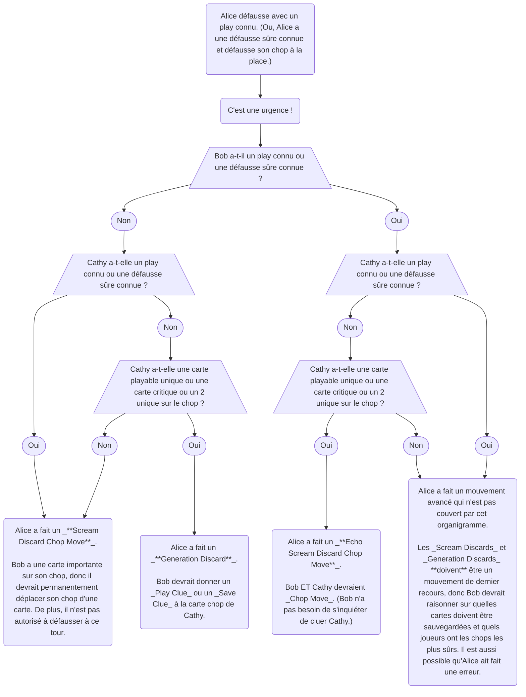

import CompositionDiscard from "../docs/level-22/composition-discard.yml";
import RebelliousDiscard from "../docs/level-22/rebellious-discard.yml";

## Conventions

### Phantom Playable Cards

- D'abord, voyez la section sur [la définition des cartes « playable »](level-1.mdx#la-définition-de-playable).
- Pour qu'une carte soit _delayed playable_, elle doit être playable « à travers » d'autres cartes cluées ou « à travers » des cartes sur _Finesse Position_. En d'autres termes, nous sommes autorisés à donner des _[Play Clues](beginner/play-clues.mdx)_ aux cartes _delayed playable_.
- Considérez qu'une catégorie légèrement différente de carte peut exister. Une carte est _Phantom Playable_ si elle est playable « à travers » des cartes qui sont visibles dans la main de quelqu'un, mais que les cartes intermédiaires ne sont pas sur _Finesse Position_ et ne sont pas encore cluées. Nous **ne sommes pas** autorisés à donner des _Play Clues_ aux cartes _Phantom Playable_ – au moins pas avant que les autres cartes soient cluées d'abord.
- Du _[Save Principle](beginner/save-principle.mdx)_, nous savons que tout le monde s'accorde à ne pas laisser défausser des cartes _playable_ ou _delayed playable_.
- Si possible, l'équipe devrait aussi essayer de protéger les cartes _Phantom Playable_ d'être défaussées également, puisqu'elles sont presque aussi importantes que les cartes _delayed playable_. Par exemple, c'est courant que d'autres personnes dans l'équipe défaussent pour laisser le joueur avec la carte _Phantom Playable_ être celui qui donne un _Play Clue_ à la carte intermédiaire.
- Parfois, les cartes _Phantom Playable_ doivent être défaussées quand l'équipe est bas en clues ou dans une situation autrement serrée. Bien que regrettable, c'est parfaitement ok et cela arrive de temps en temps.

## Mouvements Spéciaux

### Le Scream Discard pour une Phantom Playable Card

- D'abord, voyez la section sur le _[Scream Discard](level-7.mdx#le-scream-discard-chop-move-sdcm)_ et la section sur les _[Phantom Playable Cards](#phantom-playable-cards)_.
- Normalement, vous n'êtes autorisé à effectuer un _Scream Discard_ que pour une carte critique ou une carte playable. Mais qu'en est-il d'une _Phantom Playable Card_ ?
- Dans la plupart des cas, les joueurs devraient aussi _Scream Discard_ pour une _Phantom Playable Card_, mais ça dépend de la situation :
  - Sera-t-il clair pour tout le monde ce qui se passe ?
  - Les cartes intermédiaires seront-elles cluées immédiatement ?
  - Y a-t-il d'autres cartes critiques sur le chop qui doivent être sauvegardées ou qui devront bientôt être sauvegardées ?
  - La carte _Phantom Playable_ est-elle un 3 ou un 4 ?
- En résumé, c'est mieux pour l'équipe de laisser une carte _Phantom Playable_ être défaussée dans une situation délicate ou serrée, **surtout** si c'est un 4.
- Une autre façon de dire cela est que l'équipe ne devrait jamais « se plier en quatre » pour une carte _Phantom Playable_. Considérez qu'un _Scream Discard_ a toujours une petite chance de perdre la partie (si la carte _Scream Discarded_ était elle-même critique).

### Le Sacrifice Discard

- D'abord, voyez la section sur le _[Scream Discard](level-7.mdx#le-scream-discard-chop-move-sdcm)_.
- C'est généralement indésirable pour un joueur d'avoir une main _Locked_, mais parfois cela arrive. Et parfois, une carte dans la main locked est utile dans le futur, mais pas critique (signifiant qu'il y a une autre copie de la carte dans la main de quelqu'un d'autre ou encore dans le deck).
- Normalement, vous n'êtes jamais censé défausser des cartes qui ont des clues dessus. Et si vous le faites, cela implique un _[Sarcastic Discard](level-3.mdx#le-sarcastic-discard-sd)_ ou un _[Gentleman's Discard](level-10.mdx#le-gentlemans-discard-gd)_. Cependant, quand un joueur est locked, il peut choisir de « sacrifier » une des cartes dans sa main qui n'est pas critique. Et dans cette situation, cela n'implique **pas** un _Sarcastic Discard_ ou un _Gentleman's Discard_.
- Parfois, quand un joueur _Locked_ défausse une carte non-critique, c'est un _[Generation Discard](level-7.mdx#le-generation-discard)_, et parfois, c'est un _Sacrifice Discard_. Les autres joueurs dans l'équipe doivent juste décider lequel c'est en fonction de la qualité de la partie. Habituellement, c'est assez évident lequel des deux c'est, car les _Sacrifice Discards_ sont habituellement très rares et ne sont faits que dans des situations très désespérées.

### Le Echo Scream Discard Chop Move (ESDCM)

- D'abord, voyez la section sur le _[Scream Discard](level-7.mdx#le-scream-discard-chop-move-sdcm)_.
- Un _Scream Discard Chop Move_ n'est fait qu'en dernier recours. Donc, si le joueur suivant a une carte non-importante sur le chop, alors le mouvement est habituellement un _Generation Discard_ et ne _Chop Move_ personne.
- Cependant, que se passe-t-il si un _Scream Discard_ est fait et que le joueur suivant a soit :
  - une carte playable connue
  - une défausse de trash sûre connue
- Puisque les _Scream Discards_ ne sont faits qu'en dernier recours, le clue doit avoir une autre signification. Donc, il _Chop Move_ à la fois le joueur suivant **et** le joueur après cela. C'est appelé un _Echo Scream Discard_, parce que cela « rebondit » sur le joueur suivant et voyage au prochain joueur après cela comme un « double scream ».
- Similaire à un _Scream Discard_ normal, tous les joueurs qui sont _Chop Moved_ ne sont pas autorisés à défausser leur chop à leur tour suivant.
- Dans le scénario improbable où **deux** personnes d'affilée ont des plays connus / défausses sûres connues, alors le _Echo Scream Discard_ rebondira sur deux personnes et effectuera **trois** _Chop Moves_ au total. (Et trois personnes d'affilée causent quatre _Chop Moves_, et ainsi de suite.)
- Un _Echo Scream Discard_ fonctionne toujours de la même façon même quand fait avec un trash connu.

### Le Echo Shout Discard (Illégal)

- Contrairement aux _Scream Discards_, les _[Shout Discards](level-7.mdx#le-shout-discard-chop-move)_ ne peuvent pas causer des _Echo Chop Moves_. C'est parce que défausser un trash connu est beaucoup moins sévère que défausser intentionnellement une carte inconnue (qui risquerait une défaite de partie).
- Ainsi, un joueur défaussant une carte trash connue au lieu de jouer est toujours soit un seul _Shout Discard Chop Move_ soit un _Generation Discard_.

### Le Composition Discard

- D'abord, voyez la section sur le _[Scream Discard](level-7.mdx#le-scream-discard-chop-move-sdcm)_ et le _[Generation Discard](level-7.mdx#le-generation-discard)_.
- Dans de rares cas, il est possible pour une défausse d'être à la fois un _Scream Discard_ et un _Generation Discard_ en même temps, pour deux joueurs différents.
- Par exemple, dans une partie à 4 joueurs :
  - Il y a 0 clue dans la banque.
  - Alice doit planifier à l'avance pour son tour.
  - Bob et Donald ont tous deux une carte chop critique. Cathy a une défausse sûre.
  - Alice et Bob ont tous deux une carte playable connue dans leur main.
  - Donc, si Alice joue, Bob effectuera un _Generation Discard_, et défaussera une carte critique. Ce n'est pas une option.
  - Donc, Alice doit défausser. C'est un _Scream Discard_ pour Bob, et il devrait _Chop Move_. C'est aussi un _Generation Discard_ pour Cathy, et elle ne devrait pas _Chop Move_.

<CompositionDiscard />

### Le Rebellious Discard

- D'abord, voyez la section sur le _[Scream Discard](level-7.mdx#le-scream-discard-chop-move-sdcm)_.
- Une partie de la convention _Scream Discard_ stipule qu'après un _Scream Discard_, le joueur suivant **ne peut pas** défausser. Ainsi, un joueur dans cette situation doit complètement gaspiller un clue s'il n'y a rien de productif à faire.
- Cependant, dans certaines situations, le joueur à qui on a crié dessus voit que s'il donne un clue, le joueur suivant sera laissé à 0 clue et sera forcé de défausser une carte critique.
- Ainsi, dans cette situation, le joueur devrait _Chop Move_ comme normal et ensuite défausser son nouveau chop. Ce second _Scream Discard_ est appelé un _Rebellious Discard_, parce qu'il ne fait pas ce qu'on lui dit.
- Par exemple, dans une partie à 3 joueurs :
  - Red 4 est dans la pile de défausse.
  - Il y a 0 clue disponible.
  - Alice a un blue 2 playable connu.
  - Bob a un red 4 critique sur le chop. Bob n'a pas de cartes playable dans sa main.
  - La main de Cathy est _Locked_. Toutes les cartes dans la main de Cathy sont critiques. Aucune de ces cartes n'est playable.
  - Alice regarde dans le futur et voit que si elle joue le blue 2, Bob sera forcé de défausser le red 4 critique, puisque l'équipe est actuellement à 0 clue.
  - Ainsi, Alice effectue un _Scream Discard_, défaussant au lieu de jouer le blue 2 playable connu.
  - Bob sait qu'Alice a effectué un _Scream Discard_, donc il marque sa carte chop comme _Chop Moved_.
  - Bob sait aussi que, selon les règles _Scream Discard_, il n'est pas autorisé à défausser à ce tour, et doit donner un clue à la place (au cas où il aurait deux cartes critiques d'affilée).
  - Cependant, dans ce cas, si Bob faisait cela, alors Bob utiliserait le dernier clue, et puis Cathy n'aurait pas de clue disponible et serait forcée de défausser une carte critique.
  - Ainsi, Bob sait qu'il doit effectuer un _Rebellious Discard_ afin de fournir un clue pour Cathy à faire quelque chose.

<RebelliousDiscard />

## Principes Généraux

### Un Organigramme Scream Discard

Voici un organigramme pour déterminer si quelque chose est un _Scream Discard Chop Move_ ou un _Generation Discard_ :

