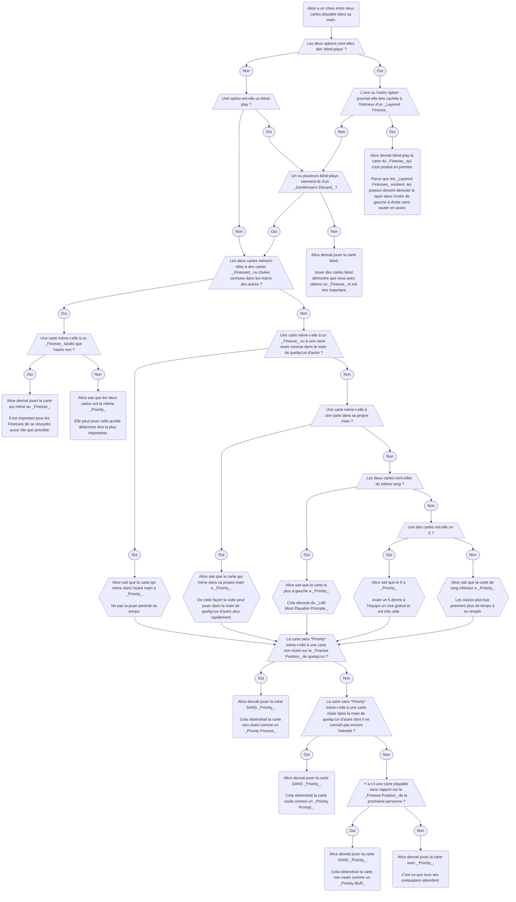

import PriorityPrompt from "../docs/level-25/priority-prompt.yml";
import PriorityFinesse from "../docs/level-25/priority-finesse.yml";
import PriorityBluff from "../docs/level-25/priority-bluff.yml";
import PriorityFinesseSpecial from "../docs/level-25/priority-finesse-special.yml";
import PriorityFinesseSpecial2 from "../docs/level-25/priority-finesse-special-2.yml";
import PriorityIntoSomeoneElsesHand from "../docs/level-25/priority-into-someone-elses-hand.yml";
import LoadClue from "../docs/level-25/load-clue.yml";
import TrustFinesse from "../docs/level-25/trust-finesse.yml";

- Ce level introduit _Priority_, qui demande aux joueurs de faire attention à l'ordre dans lequel les cartes sont jouées.
- Cela peut prendre du temps à internaliser, parce que les signaux de _Priority_ sont faciles à manquer.
- Assurez-vous d'être totalement à l'aise avec les levels antérieurs avant de tenter d'ajouter _Priority_ au mélange.

## Mouvements Spéciaux

### Le Priority Prompt & Le Priority Finesse

- Typiquement, les joueurs n'auront qu'une seule carte à jouer à la fois. Dans ce cas, à moins qu'il y ait un très bon clue à donner, il n'y a pas de décisions à prendre – ils jouent juste leur seule carte playable.
- Que se passe-t-il si un joueur a deux cartes playable ou plus à jouer ? Quelle carte devrait-il jouer en premier ?
- Si l'une des cartes n'est pas encore complètement connue (e.g. un 2 playable de couleur inconnue), alors le joueur pourrait vouloir jouer cette carte en premier afin de découvrir exactement ce que c'est. En général, **rien de spécial n'est déclenché par les joueurs jouant une carte inconnue.**
- D'un autre côté, quelque chose de spécial **peut** être déclenché si un joueur joue une carte entièrement connue, parce qu'il savait exactement ce qu'il faisait. Notre groupe s'accorde à dire que **les cartes playable devraient être jouées dans un ordre spécifique**. Nous nous référons à cela comme _Priority_. La _Priority_ convenue est :

| Priorité | Catégorie de carte                                          | Raison                                                                                                                                                                                                                                                                                                                                                                                                                  | Peut Faire Autre Chose |
| -------- | ----------------------------------------------------------- | ----------------------------------------------------------------------------------------------------------------------------------------------------------------------------------------------------------------------------------------------------------------------------------------------------------------------------------------------------------------------------------------------------------------------- | ---------------------- |
| 1        | Blind-plays                                                 | Démontrer qu'un _[Finesse](beginner/finesse.mdx)_ ou _[Bluff](level-11.mdx#le-bluff)_ s'est produit est très important.                                                                                                                                                                                                                                                                                                | ❌                     |
| 2        | Cartes qui mènent à des cartes cluées dans la main de quelqu'un d'autre | Sinon, l'équipe perdrait du _Tempo_.                                                                                                                                                                                                                                                                                                                                                                                   | ✔️                     |
| 3        | Cartes qui mènent dans la propre main du joueur             | C'est mauvais pour une suite d'être « retenue » sur un joueur.                                                                                                                                                                                                                                                                                                                                                         | ✔️                     |
| 4        | 5                                                           | Jouer un 5 donne à l'équipe un clue gratuit.                                                                                                                                                                                                                                                                                                                                                                          | ✔️                     |
| 5        | La carte de rang inférieur                                  | Les stacks plus petits sont plus importants à remplir.                                                                                                                                                                                                                                                                                                                                                                | ✔️                     |
| 6        | La carte la plus à gauche                                   | La carte la plus à gauche est plus susceptible d'être bonne.                                                                                                                                                                                                                                                                                                                                                          | ✔️                     |
| \*       | Carte inconnue                                              | Jouer des cartes inconnues aide les joueurs à gagner plus d'informations sur leur main. Notez que les cartes inconnues n'ont pas leur propre niveau de _Priority_ parce que vous devriez [appliquer la table à chaque identité possible pour la carte inconnue](#priority-avec-cartes-connues-et-inconnues). (**Rappel** : jouer une carte inconnue [ne déclenche presque jamais](#le-trust-finesse-un-priority-finesse-en-jouant-une-carte-inconnue) _Priority_.) |                        |

- Si quelqu'un joue une carte entièrement connue et que la carte n'a **pas** _Priority_, alors le joueur doit essayer d'envoyer un message spécial.
- Basé sur quelle carte il a effectivement jouée, si vous avez des cartes cluées dans votre main qui correspondent à la prochaine carte « connectante », c'est un message que vous pouvez la jouer maintenant comme un _Priority Prompt_. (C'est similaire à un _[Prompt](beginner/prompt.mdx)_ normal, sauf qu'au lieu d'initier le _Prompt_ avec un clue, ils l'ont initié avec l'ordre dans lequel ils ont joué les cartes.)
- Par exemple, dans une partie à 3 joueurs :
  - Alice a un red 1 clué + connu playable et un blue 2 clué + connu playable dans sa main. Bob a deux 3 clués dans sa main.
  - Alice joue blue 2.
  - Bob vient ensuite. Bob sait que normalement Alice avait un choix et était donc censée jouer la carte de rang le plus bas – red 1 (à moins que ce soit un blind-play, ou que cela mène dans la main de quelqu'un, ou que ce soit un 5). Alice **n'a pas** joué la carte avec _Priority_.
  - Bob ne voit pas blue 3 dans la main de Cathy. Cela doit avoir été un _Priority Prompt_. Bob joue le 3 clué le plus à gauche, et c'est blue 3.

<PriorityPrompt />

- Similaire à un _Prompt_ normal, si un _Priority Prompt_ pourrait s'appliquer à deux cartes cluées ou plus, alors vous devriez jouer la plus à gauche.
- Similaire à un _Prompt_ normal, si un _Priority Prompt_ vous a fait jouer la carte la plus à gauche et qu'elle n'était pas la carte connectante, alors vous devriez continuer à jouer des cartes cluées jusqu'à trouver la carte connectante.
- Alternativement, si vous n'avez pas de cartes cluées dans votre main qui se connectent à la carte qu'ils ont jouée, alors vous devriez jouer votre carte de _Finesse Position_ comme un _Priority Finesse_.
- Par exemple, dans une partie à 3 joueurs :
  - Alice a un red 1 clué + connu playable et un blue 2 clué + connu playable dans sa main.
  - Alice joue blue 2.
  - Bob vient ensuite. Bob sait que normalement, quand vous avez un choix entre deux cartes, vous êtes censé jouer la carte de rang le plus bas (à moins que ce soit un blind-play, etc). Bob sait qu'Alice était censée jouer le red 1 au lieu du blue 2. Alice **n'a pas** joué la carte avec _Priority_.
  - Bob voit blue 3 dans la _Finesse Position_ de Cathy. Cela signifie qu'Alice a en fait fait un _Priority Finesse_ sur Cathy, pas sur Bob. Bob fait quelque chose sans rapport.
  - Cathy blind-play sa carte de _Finesse Position_. C'est un blue 3.

<PriorityFinesse />

### Le Priority Bluff

- Similaire à un _Bluff_ normal, il est aussi possible pour les joueurs d'effectuer un _Priority Bluff_.
- Par exemple, dans une partie à 3 joueurs :
  - Alice a un red 1 connu playable et un blue 2 connu playable dans sa main.
  - Alice joue blue 2.
  - Bob vient ensuite. Bob sait que normalement, quand vous avez un choix entre deux cartes, vous êtes censé jouer la carte de rang le plus bas. (À moins que ce soit un blind-play, ou que cela mène dans la main de quelqu'un, ou que ce soit un 5.) Bob ne voit pas de blue 3, donc il sait qu'Alice était censée jouer le red 1 au lieu du blue 2. Alice **n'a pas** joué la carte avec _Priority_.
  - Cela signifie que Bob doit avoir un blue 3. Bob n'a pas de cartes cluées dans sa main, donc il blind-play sa carte de _Finesse Position_. Ce **n'est pas** le blue 3 et c'est à la place le green 1. Bob sait maintenant qu'il a été _Bluffed_ et que personne n'a le blue 3.

<PriorityBluff />

### Le Layered Priority Finesse

- Similaire à un _[Layered Finesse](level-5.mdx#le-layered-finesse)_ normal, il est aussi possible d'initier un _Layered Priority Finesse_ tant que le joueur qui blind-play n'est pas la toute prochaine personne.

### Le Load Clue

- D'abord, voyez la section sur le [Priority Prompt & Le Priority Finesse](#le-priority-prompt--le-priority-finesse).
- À Hanabi, c'est optimal de jouer des cartes qui mènent dans les mains de vos coéquipiers parce que cela gagne du _Tempo_ et réduit le risque bottom-deck. _Priority_ est optimisé pour le cas spécial où la prochaine carte est sur la _Finesse Position_ de quelqu'un. Cependant, c'est en réalité plus courant que la prochaine carte ne soit pas sur _Finesse Position_. Comme vous pouvez l'imaginer, un énorme inconvénient de jouer avec _Priority_ est que vous ne pouvez pas jouer dans des cartes non-_Finesse Position_ (ou sinon quelqu'un misplayerait).
- Pour cette raison, nous nous accordons à dire que si une carte est visible dans la non-_Finesse Position_ de quelqu'un d'autre, alors les _Priority Finesses_ sont désactivés et l'équipe est engagée à donner un clue direct à la prochaine carte.
- Ce clue est similaire à un _Fix Clue_, puisqu'il corrige un misplay imminent d'une situation qui ressemble à un _Priority Finesse_. Mais nous appelons spécifiquement ce type de clue un _Load Clue_ pour le différencier d'un _Fix Clue_ qui corrige un _Lie_ ou une erreur. C'est un _Load Clue_ parce qu'il charge le joueur qui a reçu le clue avec quelque chose à faire à son tour.
- Par exemple, dans une partie à 3 joueurs :
  - Red 1 et blue 1 sont joués sur les stacks.
  - Alice a un choix entre jouer un red 2 connu ou un blue 2 connu. Le red 2 a _Priority_ parce que c'est la carte la plus à gauche.
  - Alice joue le blue 2.
  - Bob voit que la main de Cathy est, du plus récent au plus ancien : `yellow 4, yellow 3, yellow 4, red 1, blue 3`
  - Bob voit que Cathy pensera qu'Alice effectue un _Priority Finesse_ sur le blue 3. Ainsi, Bob doit maintenant donner un _Load Clue_ pour arrêter le misplay imminent.
  - Bob clue nombre 3 à Cathy.
  - Cathy est surprise – elle était sur le point de jouer sa carte de _Finesse Position_ comme un blue 3, mais elle sait maintenant que ce ne peut pas être un blue 3.
  - Si c'était un _Fix Clue_, Cathy pourrait être encline à jouer la carte qui était la plus proche de son slot 1 (qui serait le 3 au slot 2).
  - Cependant, Cathy sait que les _Load Clues_ doivent être interprétés comme des _Play Clues_ normaux au lieu de _Fix Clues_, donc elle interprète cela comme un _Chop-Focus Play Clue_ normal et joue blue 3 du slot 5.

<LoadClue />

- Quand un joueur reçoit un _Load Clue_, il doit l'interpréter comme un _Play Clue_ normal au lieu d'un _Fix Clue_.
- Un clue est toujours un _Load Clue_ même s'il ressemblerait autrement à un _Save Clue_. (En d'autres termes, la carte promise du mouvement _Priority_ doit être _quelque part_.)
- Les _Load Clues_ sont uniques en ce qu'ils sont le seul mouvement qui viole l'_[Information Lock Principle](level-3.mdx#information-lock-principle)_. En d'autres termes, quand un joueur réalise qu'il a reçu un _Load Clue_, il doit rembobiner à quand le _Priority Move_ s'est produit, supprimer toutes ses notes liées à _Priority_, et puis ré-interpréter le clue à partir de zéro.
- Si vous recevez un _Load Clue_, vous devriez suspecter que vous pourriez avoir quelque chose de précieux sur votre chop, car ce serait une excellente raison d'engager l'équipe à donner le _Load Clue_ en premier lieu.
- Si un joueur a un choix entre jouer une carte qui ne mène nulle part et jouer une carte qui engage l'équipe à donner un _Load Clue_, alors il n'est pas obligé de choisir l'un ou l'autre – il peut choisir celui qui est le mieux pour la situation.

### Le Paused Priority Finesse

- Pour les besoins de _Priority_, blind-play une carte est la chose la plus importante à faire. Quand les joueurs sont censés blind-play une carte, ils ne sont habituellement **pas** autorisés à effectuer un _Priority Finesse_ – ils doivent s'en tenir à jouer la carte blind.
- Une exception à cela est si un joueur est en train de dérouler le layer d'un _Layered Finesse_. Puisqu'il a déjà blind-played sa première carte dans le layer, il a démontré que le _Finesse_ était sur lui, et maintenant tout le monde dans l'équipe sait que le reste des cartes à l'intérieur du layer sont « obtenues » avec certitude.
- Ainsi, dans cette situation, un joueur peut « mettre en pause » la finition du _Layered Finesse_ et jouer une autre carte cluée pour effectuer un _Priority Finesse_. C'est appelé un _Paused Priority Finesse_.
- Notez que cela ne s'applique que quand la carte qui a été blind-play était sans rapport avec le _Layered Finesse_ original.
  - Par exemple, si un joueur est _Finessed_ pour à la fois le red 1 et le red 2 et a juste blind-play un green 1, alors il peut effectuer un _Priority Finesse_, parce que tout le monde dans l'équipe sait que le green 1 a joué comme red 1 et donc que le layer n'est pas encore déroulé.
  - Cependant, si un joueur est _Finessed_ pour à la fois le red 1 et le red 2 et a juste blind-play le red 1, alors il **ne peut pas** effectuer un _Paused Priority Finesse_ parce qu'il n'a pas démontré à l'équipe qu'il est encore _Finessed_ pour le red 2.

### Le Trust Finesse (Un Priority Finesse en Jouant une Carte Inconnue)

- Selon les règles de _Priority_, si une carte inconnue est jouée, aucun _Priority Finesse_ ne peut être déclenché.
- Cependant, même si c'est le cas, si jouer l'une des cartes plutôt que l'autre serait **extrêmement** suboptimal, cela devrait toujours déclencher un _Finesse_.
- Ce type de mouvement est appelé un _Trust Finesse_ pour le distinguer du cas où la carte est globalement connue.
- Il est aussi possible d'effectuer un _Trust Prompt_, un _Trust Bluff_, et ainsi de suite.
- Par exemple, dans une partie à 3 joueurs :
  - Tous les 1 sont joués sur les stacks.
  - Alice a deux cartes playable dans sa main :
    - Une des cartes a un clue rouge dessus. Puisqu'elle a été originellement cluée comme un _[Play Clue](beginner/play-clues.mdx)_, elle est globalement connue comme un red 2.
    - Une des cartes a un clue de nombre 2 dessus. Puisqu'elle a été originellement cluée avec un _[Save Clue](beginner/save-clues.mdx)_, ça peut être n'importe quel 2 non-rouge. Mais elle est playable parce que tous les 1 sont déjà joués.
  - Bob a un red 3 clué et globalement connu dans sa main.
  - Alice sait qu'elle est censée jouer son red 2 dans le red 3 de Bob, parce que ce serait du bon travail d'équipe.
  - Inconnu du reste de l'équipe, Alice sait du contexte de la partie que son 2 doit être exactement blue 2.
  - Bob a blue 3 sur sa _Finesse Position_.
  - Alice joue le 2 globalement inconnu pour causer un _Trust Finesse_.

<TrustFinesse />

## Autres Conventions Liées à Priority

### Un Organigramme Priority (pour Choisir Entre 2+ Cartes Playable)

Priority peut être déroutant. Voici un organigramme qui montre, en général, quelle carte devrait être jouée quand il y a un choix entre deux cartes :

### Priority avec Blind-Plays

Comme indiqué ci-dessus, blind-play des cartes a la priorité la plus élevée (parce que démontrer qu'un _Finesse_ ou _Bluff_ s'est produit est très important). Cependant, les cartes qui ont une note d'identité exacte dessus ne comptent pas comme des « blind-plays » pour les besoins de _Priority_. Spécifiquement :

- Après un _[Gentleman's Discard](level-10.mdx#le-gentlemans-discard-gd)_ ou un _[Baton Discard](level-10.mdx#le-baton-discard-bd)_, l'autre copie de la carte a une note d'identité exacte dessus. Ainsi, elle compte comme « cluée » pour les besoins de jouer dans _Priority_.
- Après que des _[Elimination Notes](level-18.mdx#elimination--elimination-notes)_ ont été éliminées de toutes sauf une carte, la carte finale a une note d'identité exacte dessus. Ainsi, elle compte comme « cluée » pour les besoins de jouer dans _Priority_.

### Priority avec Cartes Connues et Inconnues

- Pour réviser, si un joueur a deux cartes playable, et que les deux sont entièrement connues, alors elles ont toujours la capacité de déclencher _Priority_.
- Si un joueur a deux cartes playable, et qu'une seule d'entre elles est entièrement connue, _Priority_ ne sera jamais déclenchée s'il joue la carte inconnue.
- Mais que se passe-t-il si un joueur joue une carte entièrement connue plutôt qu'une carte inconnue ? Il **peut toujours** déclencher _Priority_, mais **uniquement** si la carte qui a été jouée a une _Priority_ inférieure à **chaque** possibilité pour la carte inconnue.
- Par exemple, dans une partie à 3 joueurs :
  - Red 2 est joué sur les stacks. Les 1 sont joués sur tous les autres stacks.
  - Alice a un red 3 globalement connu.
  - Alice a un 2 de couleur inconnue. Spécifiquement, ça peut être soit blue 2, green 2, yellow 2, ou purple 2 (du _[Good Touch Principle](beginner/good-touch-principle.mdx)_).
  - Le reste de l'équipe n'a pas de cartes cluées dans ses mains.
  - Alice sait que red 3 a une _Priority_ inférieure à **toutes** les possibilités pour le 2. (Toutes les possibilités pour le 2 sont de rang inférieur.)
  - Alice joue le red 3, ce qui déclenche un _Priority Finesse_ sur le red 4.

<PriorityFinesseSpecial />

- Par exemple, dans une partie rainbow à 3 joueurs :
  - Red 2 et rainbow 2 sont joués sur les stacks. Les 1 sont joués sur tous les autres stacks.
  - Alice a un red 3 globalement connu.
  - Alice a une carte blue playable de rang inconnu. Cela pourrait être soit blue 2 ou rainbow 3.
  - Alice sait que le red 3 a une _Priority_ inférieure au blue 2 et que red 3 a une _Priority_ supérieure au rainbow 3 (parce que le red 3 est le plus à gauche).
  - Le reste de l'équipe n'a pas de cartes cluées dans ses mains.
  - Alice joue le red 3, ce qui ne déclenche pas un _Priority Finesse_ (parce que la _Priority_ des possibilités dans la superposition sont mélangées).

<PriorityFinesseSpecial2 />

### Situations Où Priority Ne S'Applique Pas

Priority ne s'applique pas toujours. Quelques exceptions courantes sont listées ci-dessous.

#### 1) _End-Game_

- _Priority_ est généralement « désactivée » dans l'_End-Game_, parce que les joueurs ont souvent besoin de jouer des cartes spécifiques.
- Cela dit, _Priority_ peut toujours fonctionner si un joueur joue une carte qui serait vraiment terrible pour l'équipe autrement.

#### 2) La 4's Priority Exception

- Si un joueur a un 5 connu playable et un 4 connu playable qui mène dans sa propre main, alors selon la table _Priority_ ci-dessus, le 4 connu playable aurait _Priority_. Cependant, cela n'a pas beaucoup de sens, puisque le 5 doit être joué peu importe quoi, jouer le 5 redonne un clue à l'équipe, le 4 pourrait être distribué à quelqu'un d'autre, et ainsi de suite.
- Ainsi, si un joueur a un 5 connu playable et un 4 connu playable qui mène dans sa propre main, alors le 5 est dit avoir _Priority_.
- La _4's Priority Exception_ s'applique aussi aux 3 dans le cas rare où il y a à la fois un 3 et un 4 et un 5 de la même suite dans la même main.

#### 3) Blind-Playing des Cartes Globalement Connues

- Normalement, blind-play des cartes a _Priority_ sur tout le reste.
- Cependant, dans certains cas avancés, le blind-play n'a pas besoin d'être démontré à l'équipe – tout le monde a déjà la pleine connaissance de ce qui se passe. Dans ce cas, les joueurs sont censés traiter les cartes comme cluées pour les besoins de trouver _Priority_. (Le _Gentleman's Discard_ est le mouvement principal auquel cela s'applique.)

#### 4) Cartes « Importantes »

- Normalement, les cartes qui sont du même rang devraient être jouées de gauche à droite.
- Cependant, dans certaines situations, les joueurs peuvent savoir qu'une **autre** carte est **plus importante** que la carte la plus à gauche. Si un joueur joue une carte « plus importante », cela ne devrait jamais déclencher un _Priority Finesse_ de style « droite à gauche ».
- Par exemple, dans une partie à 3 joueurs :
  - Dans l'_Early Game_, Alice clue nombre 2 à Bob, touchant trois 2 au slot 3, slot 4, et slot 5 (son chop). (C'est la convention _2 Save_.)
  - Plus tard dans la partie, tous les 1 sont maintenant joués sur les stacks.
  - Bob n'a pas reçu d'autres clues depuis – tous ses 2 sont connus playable, mais il n'a aucune idée de quelle couleur ils sont.
  - Normalement, Bob sait qu'il est censé jouer ses 2 de gauche à droite. Cependant, il sait aussi que son 2 au slot 5 est la carte la plus importante de toutes – c'était le focus du _2 Save_ original par Alice.
  - Ainsi, Bob joue son 2 au slot 5 en premier. Après cela, il joue les 2 de gauche à droite comme normal.

### Jouer Dans la Main de Quelqu'un d'Autre

- Pour les besoins de jouer dans la main de quelqu'un d'autre, nous ne considérons que ce qu'est la toute prochaine carte, afin de garder les choses simples.
- Par exemple, dans une partie à 3 joueurs :
  - Alice a un blue 3, red 3, et red 4 globalement connus.
  - Bob a un blue 4 globalement connu.
  - Cathy a un red 5 globalement connu.
  - Ici, Alice sait que quand elle joue des cartes dans les mains des autres joueurs, elle est seulement censée considérer ce qu'est la toute prochaine carte.
  - Ainsi, Alice joue le blue 3 dans le blue 4 de Bob.

<PriorityIntoSomeoneElsesHand />

- L'exception évidente à cette règle est si l'un des joueurs dans l'équipe est locked. Dans cette situation, c'est mieux de travailler à débloquer ce joueur.
